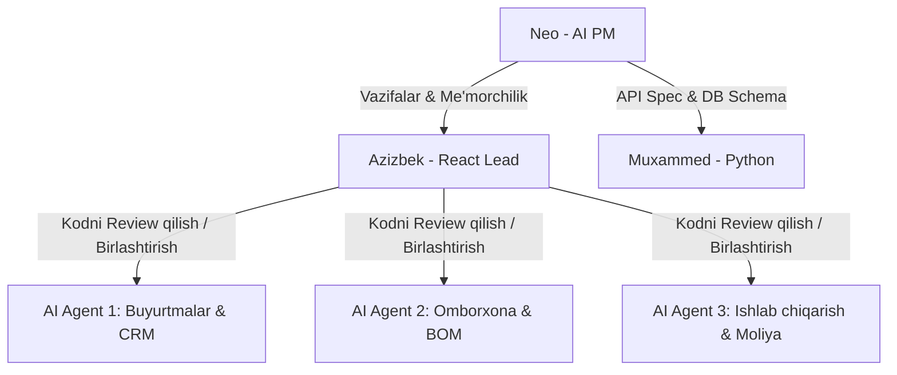

# 🪵  : Mebel Ishlab Chiqarishni Boshqarish Tizimi
## Texnik Topshiriq (PRD - Product Requirement Document)

> **Loyiha Menejeri:** Neo (AI PM)  
> **Buyurtmachi:** Karsoft (Direktor/Ega)  
> **Backend:** Muxammed (Python Developer)  
> **Frontend Lead:** Azizbek (React Developer)  
> **Frontend Ko'makchilari:** 3 ta AI Frontend Agentlari (Ofis kompyuterlarida)  
> **Muddati:** 06:00 AM (Ertaga 5-iyun) gacha reja va TZ tayyorlash.

---

## 1. Kirish va Loyiha Maqsadi
Ushbu tizim **mebel ishlab chiqarish sexi (tsex)** uchun mo'ljallangan bo'lib, buyurtma qabul qilishdan boshlab, tayyor mahsulotni mijozga topshirguncha bo'lgan barcha jarayonlarni avtomatlashtiradi.
Tizim sexdagi materiallar sarfi (laminat, MDF, furnitura, shisha), ishchilarning bajargan ishlari va ularning ishbay ish haqi (sdelniy), ishlab chiqarish bosqichlari (arra, kromka, sborka, kraska, OTK) va moliyaviy oqimlarni real vaqt rejimida boshqarish imkonini beradi.

---

## 2. Loyiha Rollari va Ishni Tashkil Qilish Formati

### Jamoa a'zolari va ularning vazifalari:
1. **Neo (AI PM):** Loyihaning arxitekturasi, API spetsifikatsiyalari, ma'lumotlar bazasi sxemasini loyihalashtiradi, vazifalarni taqsimlaydi va jarayonni nazorat qiladi.
2. **Muxammed (Backend - Python):** REST API ishlab chiqish, ma'lumotlar bazasini sozlash, biznes mantiqni (BOM hisob-kitoblari, ombordan material chegirish, moliya) yaratish.
3. **Azizbek (Frontend Lead - React):** Shared components (loyihaning umumiy UI komponentlari kutubxonasi, masalan, Tailwind, Shadcn), marshrutlash (routing), global holat boshqaruvi (state management) va marshrutlar xavfsizligini ta'minlash. **AI Agentlar yozgan kodlarni code review qilib, master branchga birlashtirish.**
4. **AI Frontend Agentlari (3 ta kompyuterda):**
   * **Agent 1:** Buyurtmalar (CRM), mijozlar bazasi va o'lchovlar moduli frontend qismini yozadi.
   * **Agent 2:** Omborxona, xomashyolar, materiallar hisobi va BOM (retseptlar) frontend qismini yozadi.
   * **Agent 3:** Ishlab chiqarish konveyeri (Kanban doska), ishchilar (ustalar) paneli va moliya paneli frontend qismini yozadi.

---

## 3. Tizimning Funktsional Modullari (Features Scope)

### 3.1. CRM va Lidxonlik Quvuri (Lead to Order Pipeline)
* **Lead Manbalari:** Telefon qo'ng'irog'i, Telegram, Instagram yoki Ofisga kelish (Walk-in).
* **Bosqichma-bosqich oqim (Lead Pipeline):**
  1. **Lid Yaratilishi:** Ofis menejeri murojaatni qabul qiladi, manbani belgilaydi va tizimga mijoz ma'lumotlarini (F.I.O, telefon) kiritadi.
  2. **Zamer (O'lchov) Tayinlash va Planshet paneli:**
     * Ofis foydalanuvchisi tizimdan o'lchovchini tanlaydi, manzil va vaqtni belgilaydi.
     * O'lchovchiga planshetidagi maxsus dashboardda yangi topshiriq va manzil xaritasi ko'rinadi.
     * **Ekspert O'lchovlar Formati (Planshetda to'ldiriladi):**
       * *Xona turi:* Oshxona, Spalniy, Detshiy, Dahliz, Ofis, boshqa.
       * *Burchaklar burchagi (90° lik tekshiruv):* Burchak aniqligi, og'ishlar bor-yo'qligi.
       * *Devor materiallari:* Gipsokarton (gips), g'isht, beton, gazoblok (shkaf osish uchun juda muhim).
       * *Kommunikatsiya nuqtalari:* Sockets (rozetkalar), gaz/suv quvurlari, shamollatish (ventilatsiya) teshigi, radiatorlar (batareya) koordinatalari.
       * *Asosiy o'lchamlar:* Devorlar bo'ylab o'lchamlar (A devori, B devori, C devori), shift balandligi, polning notekisligi (gradusda).
       * *Maishiy texnika:* Joylashadigan texnikalar ro'yxati (vstraivaemiy yoki alohida) va o'lchamlari.
       * *Fayllar:* Qo'lda chizilgan eskiz fotosurati va xonaning har burchagidan olingan 3-4 ta real fotosuratlar.
  3. **3D Dizayn Loyihalash (Ofisda Kompyuterda):**
     * Ofisdagi 3D mutaxassisi zamerchik kiritgan o'lchamlar asosida kompyuterda 3D modelni chizadi (3ds Max, AutoCad, SketchUp va h.k.).
     * Tayyor bo'lgan 3D model faylini (masalan, OBJ, GLTF/GLB ko'rish formati yoki chizma render rasmlarini) tizimdagi ushbu buyurtmaga bog'lab **import qiladi**.
  4. **Buyurtma Kichik TZ va Vaqt Rejasi (Order Mini-TZ & Scheduling):**
     * Shartnoma tuzilishidan oldin, menejer ushbu buyurtma uchun kichik texnik topshiriq (Mini-TZ) va uning **kunbay yo'l xaritasini** tuzadi.
     * Tizimda loyihaning umumiy boshlanish va yakunlanish vaqtlari belgilanadi.
     * Menejer buyurtma uchun kerakli texnologik etaplarni faollashtiradi (masalan, ayrim mebellar uchun Pristadka yoki Ustanovka kerak bo'lmasligi mumkin) va har bir etapning boshlanish/yakunlanish kunlarini kiritadi (Masalan: 1-2 kun Raskroy, 3-kun Kromka, 4-kun Pristadka, 5-6 kun Sborka, 7-kun Ustanovka).
     * Ushbu rejalashtirilgan muddatlar asosida shartnomaning yakuniy yetkazib berish muddati avtomatik shakllanadi.
  5. **Dinamik Shartnoma Tuzish (Contract Generation - O'zR qonunchiligi):**
     * Dizayn va kunbay reja (Mini-TZ) tasdiqlangach, ofis menejeri shartnoma generatsiya qilish oynasida quyidagi parametrlarni **dinamik ravishda** kiritadi:
       * *Avans foizi (%) yoki Summasi:* Mijoz to'laydigan dastlabki ulush (masalan, 30%, 40% yoki 50%).
       * *Kafolat muddati:* Standart 12 oy yoki kelishilgan dinamik muddat.
       * *Kechikish uchun penya (jarima) foizi:* Har bir kechiktirilgan kun uchun standart 0.1% - 0.5% oralig'ida dinamik ko'rsatkich.
     * Tizim kiritilgan parametrlarga qarab shartnomani O'zbekiston Respublikasi Fuqarolik Kodeksi talablariga moslab generatsiya qiladi. Shartnoma shu zahoti ofis printeriga chiqariladi va imzolanadi.
  6. **Avans To'lovi (Downpayment):**
     * Shartnoma imzolangan vaqtda olingan avans summasi tizimga kiritiladi va unga mos ravishda to'lov turi (naqd, plastik karta, pul o'tkazish) belgilanadi.
     * Avans to'lanishi bilan buyurtma avtomatik ravishda `PRODUCTION` holatiga o'tadi, BOM materiallari zaxiraga olinadi va kunbay rejadagi etaplar ustalar panelida faollashadi.

* **Tizimdagi Statuslar Ketma-ketligi:**
  `Yangi Lid` -> `O'lchov Belgilandi` -> `O'lchov Yuklandi` -> `3D Loyihalashda` -> `Dizayn Tasdiqlandi` -> `Kichik TZ / Reja Tuzildi` -> `Shartnoma Imzolandi (Avans To'landi)` -> `Ishlab Chiqarishda` -> `Tayyor (OTK)` -> `O'rnatildi (Yopildi)`.

### 3.2. Mahsulot Retsepti va BOM (Bill of Materials)
* Har bir tasdiqlangan buyurtma uchun avtomatik yoki qo'lda **Texnologik Xarita (BOM)** shakllantiriladi.
* Tizimda ishlatiladigan xomashyolar quyidagi o'lchov birliklarida hisoblanadi:
  * **Plitalar (DSP/Laminat, Akril, HDF, MDF):** Butun plita (`List` - bo'yi x eni o'lchamlari bilan) ko'rinishida hisoblanadi. (Masalan: L DSP 2.50x1.83m = 4.6 m²; Akril 2.40x1.20m).
  * **Chiziqli materiallar (Kromka, Truba, Plentuz):** Metrda (`Metr`).
  * **O'lchovli va Dona tovarlar (Topsa/Petli, Rushka, Porshun, Noshka, Rolik, Zamok, Moyka, Sushelka, Push):** Donada (`Shtuk`).
  * **Og'irlikdagi xomashyolar (Yelim, Shrup, Shege/Mix):** Kilogrammda (`kg`).
  * **Oyna va Shishalar (Zerkla):** Kvadrat metrda (`m/kv`).
* **Avtomatik tannarx hisoblagich:** Tizim ombordagi joriy o'rtacha narxlarni olib, BOM ro'yxatidagi materiallar summasini jamlaydi va mahsulotning xomashyo tannarxini hisoblab beradi.

### 3.3. Omborxona va Xomashyo Nazorati (Warehouse)
* **Kategoriyalar va Ma'lumotlar Bazasi:** Tizim ombori `mebelalimplas.xlsx` ma'lumotlari asosida quyidagi toifalarga bo'linadi:
  * *Plitalar:* L DSP, Akril, HDF, MDF.
  * *Stolishnitsalar:* Stolishnitsa Rossiya (3m, 4m), Burchakli stolishnitsa, Stolishnitsa ugl stik.
  * *Kromkalar:* Kromka 19/0.4, 19/0.6, 19/1, 21/1, 35/1.
  * *Furnitura & Fasteners:* Topsa, Garbatiy/Pol garbatiy petlilar, Evro shrup, Shrup, Shege (mix), Flyans, Truba, Zamok, Ushkiy, Naklika, Dvaynoy skosh.
  * *Aksessuarlar:* Rushka (kishi, orta, ulken), Rolik, Porshun (gazlift), Veshelka, Noshka (klipsiy, nerjabika), Plentuz (ugl, zakrity0), Sushelka, Moyka, Gol rushka, Gol profil, Push.
* **Kirim va Partiyalar:** Har bir kirim operatsiyasida tovar miqdori va partiya narxi (FIFO/O'rtacha narx uchun) kiritiladi.
* **Materiallarni Bron Qilish (Reservation):** 
  * Shartnoma imzolangach, tizim BOM bo'yicha kerakli materiallarni avtomatik ravishda **Zaxira (Rezerv)** holatiga o'tkazadi. Rezervdagi materiallar jismonan omborda tursa ham, boshqa buyurtmalar uchun "Mavjud" (Available) deb ko'rsatilmaydi.
  * Sexda arra (Cutting/Raskroy) boshlanishi bilan rezervdagi materiallar ombordan haqiqiy **Chiqim (Deducted)** qilinadi.
* **Qoldiq Bo'laklar (Off-cuts) hisobi:** Arra jarayonida qolgan va ishlatishga yaroqli bo'lgan plita bo'laklari (masalan: 1.2m x 0.8m) usta tomonidan planshet orqali omborga "Qoldiq" sifatida kirim qilinadi va keyingi buyurtma BOMida birinchi navbatda ishlatish uchun tavsiya etiladi.
* **Minimal Qoldiq va Ogohlantirish (Alerts):** Har bir tovar uchun eng kam qoldiq chegarasi (`min_threshold`) o'rnatiladi. Qoldiq bu chegaradan tushsa, tizim administratorga "Omborda tovar tugamoqda" degan xabarnoma beradi.

### 3.4. Ishlab Chiqarish Quvuri (Production Pipeline)
* Ishlab chiqarish jarayoni aniq 5 ta texnologik bosqichdan iborat bo'ladi (Kanban doskasida va ustalar panelida aks etadi):
  1. **Raskroy (Maydalash / Plitani kesish):** DSP/MDF butun listlari tasdiqlangan chizma bo'yicha mayda detallarga bo'lib kesiladi. (Ombordan materiallarni zaxiradan chiqarish va yaroqli qoldiq bo'laklarni kirim qilish aynan shu bosqichda amalga oshiriladi).
  2. **Kromka (Lenta yopishtirish):** Kesilgan detallarning chekka (yon) qismlariga mebel lentasi (kromka) yopishtirish stanogida yopishtiriladi.
  3. **Pristadka (Teshish):** Detallarni oson yig'ish uchun ulardagi shurup, topsa (petlya) va evroshrup qotiriladigan joylar maxsus teshish stanogida teshiladi.
  4. **Sborka (Sexda yig'ish):** Barcha tayyor va teshilgan detallar sexda birlashtirilib, butun mebel holatiga keltiriladi, eshik va furnituralari o'rnatiladi.
  5. **Ustanovka (O'rnatish va OTK):** Tayyor mebel mijozning uyiga/ofisiga yetkaziladi va o'rnatib beriladi. Mijoz qabul qilib olgach, buyurtma yopiladi.
* Har bir bosqich uchun mas'ul usta planshet orqali tayinlanadi va ish tugagach usta `Finish` tugmasini bosib keyingi bosqichga o'tkazadi.

### 3.5. Ustalar Doskasi va Ishbay (Sdelniy) Ish Haqi
* Har bir usta o'zining shaxsiy ID/Pin-kodi orqali tizimga kiradi (yoki planshetdan foydalanadi).
* Usta o'ziga yuklatilgan operatsiyani boshlaydi (`Start`) va tugatadi (`Finish`).
* **Tariflar jadvali:**
  * Raskroy: 1 kv.m kesish = X so'm.
  * Kromka: 1 metr yopishtirish = Y so'm.
  * Sborka: 1 dona mebel = Z so'm (yoki umumiy buyurtma summasining % foizi).
* Tizim ustaning bajargan ishlari asosida uning kunlik/haftalik/oylik ish haqini avtomatik hisoblab boradi.

### 3.6. Moliya va Analytics
* **Kirimlar:** Mijozlardan tushgan to'lovlar (naqd, plastik karta, hisob-raqam).
* **Chiqimlar:** Material sotib olish, ishchilarga oylik berish, arenda, elektr va boshqa sex xarajatlari.
* **Sof Foyda (Net Profit) Tahlili:** Buyurtma summasi - (Xomashyo tannarxi + Ustalar mehnati + Qo'shimcha xarajatlar).

### 3.7. Menejer Boshqaruv va Nazorat Paneli (Manager Dashboard & Gantt)
* **Kalendar va Kunbay Reja (Gantt/Timeline):**
  * Menejer uchun barcha faol buyurtmalarning kunbay rejasi (Gantt yoki chiziqli grafik ko'rinishida) aks etadi. 
  * Grafikda har bir buyurtmaning bosqichlari (Raskroy, Kromka, Pristadka, Sborka, Ustanovka) uchun rejalashtirilgan vaqt oralig'i (Planned) va amaldagi bajarilish vaqti (Actual) yonma-yon ko'rsatiladi.
* **Kechikishlarni Ogohlantirish Tizimi (Delay Alert System):**
  * Agar biror-bir bosqich (masalan, *Raskroy*) rejalashtirilgan muddatdan o'tib ketgan bo'lsa va hali usta tomonidan `Finish` qilinmagan bo'lsa, tizim menejer panelida va jami buyurtmalar ro'yxatida **🚨 QIZIL OGOHLANTIRISH** (Late Alert) belgisini ko'rsatadi.
  * *Status indikatorlari:* `ON_TIME` (Yashil - reja bo'yicha ketmoqda), `RISK` (Sariq - muddat yaqinlashmoqda), `DELAYED` (Qizil - kechikdi).
* **Kunlik Topshiriqlar Ro'yxati (Daily Ops View):**
  * Menejerga har kuni "Bugun bajarilishi rejalashtirilgan operatsiyalar" ro'yxatini chiqarib beradi (Masalan: "Bugun 3 ta buyurtma bo'yicha Raskroy va 1 ta buyurtma bo'yicha Sborka tugashi kerak"). Buni menejer ustalar bilan tezkor muvofiqlashtirish uchun ishlatadi.
* **Tarixiy Tahlil (Planned vs Actual Report):**
  * Yopilgan buyurtmalar bo'yicha rejalashtirilgan kunlar va amalda ketgan kunlarni solishtirib, kelgusi buyurtmalarga aniqroq muddat qo'yish uchun statistik hisobot beradi.
* **Ishchilarni Kunlik Taqsimlash va Yo'qlama (Daily Worker Assignment & Attendance):**
  * Menejer har kuni ertalab tizimga kirib, 10 dan ortiq sex ishchilarining bugungi kunlik statusini belgilaydi:
    * `Sexda (WORKSHOP)`: Sex ichidagi ishlarni (Raskroy, Kromka, Pristadka, Sborka) bajaradiganlar.
    * `Ustanovkada (INSTALLATION)`: Buyurtmalarni mijoz uyiga o'rnatishga boradiganlar.
    * `Kelmagan (ABSENT)`: Bugun ishda bo'lmaganlar.
  * Vazifalarni ishchilarga topshirishda tizim ushbu kunlik statusdan foydalanadi. Masalan, Ustanovka vazifasiga faqat bugun `Ustanovkada` deb belgilangan xodimlarni, sex ichidagi ishlarga esa faqat `Sexda` bo'lgan xodimlarni biriktirish mumkin (dropdown filtri orqali xatoliklar oldi olinadi).

---

## 4. Texnologik Stek (Tech Stack)

### Frontend (React.js)
* **Framework/Library:** React.js (Vite bilan yig'ilgan).
* **Styling:** Tailwind CSS + Shadcn UI (tayyor va chiroyli komponentlar uchun).
* **State Management:** Zustand (engil va tezkor) yoki Redux Toolkit.
* **Routing:** React Router DOM v6.
* **Charts:** Recharts (analitika va diagrammalar uchun).

### Backend (Python)
* **Framework:** Django REST Framework (DRF). Tayyor admin paneli, xavfsiz va ishonchli ORM.
* **Database:** PostgreSQL.
* **Authentication:** JWT (JSON Web Tokens).

---

## 5. UI/UX Dizayn Prinsiplari va Vizual Dizayn

1. **To'liq Dark Mode / Slate Premium UI:** Sex sharoitida chang va yorug'lik o'zgaruvchan bo'lgani sababli, kontrastli, chiroyli to'q rangli (Slate/Zinc) interfeys va ko'zni charchatmaydigan ranglar sxemasi.
2. **Kattalashtirilgan Bosish Elementlari:** Sexdagi ustalar planshet yoki mobil telefonda ishlatganda oson bosilishi uchun tugmalar va kartochkalar kattaroq bo'ladi.
3. **Jonli Statuslar (Live Updates):** Ishlab chiqarish holatini kuzatish uchun tezkor interfeys.
