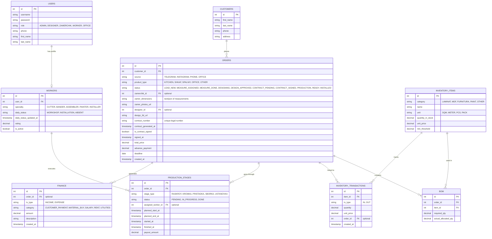

# 📐 WoodFlow ERP: Tizim Arxitekturasi va API Spetsifikatsiyasi
> **Backend Dasturchi:** Muxammed (Python/DRF) uchun qo'llanma.

Ushbu hujjat tizimning ma'lumotlar bazasi arxitekturasi va REST API so'rovlarini belgilab beradi.

---

## 1. Ma'lumotlar Bazasi Sxemasi (Database Schema)

Tizim PostgreSQL uchun quyidagi munosabatlar va jadvallarni talab qiladi:

---

## 2. API Endpoints (REST API Specification)

Barcha endpointlar JWT Token orqali himoyalanadi va so'rov sarlavhasida `Authorization: Bearer <token>` talab qiladi.

### 2.1. Avtorizatsiya (Auth)
* `POST /api/v1/auth/login/` - Tizimga kirish (username & password). JWT token qaytaradi.
* `POST /api/v1/auth/refresh/` - Tokenni yangilash.
* `GET /api/v1/auth/me/` - Joriy foydalanuvchi ma'lumotlarini olish.

### 2.2. CRM, Lidxonlik va Shartnoma Moduli
* `GET /api/v1/customers/` - Mijozlar ro'yxatini olish.
* `POST /api/v1/customers/` - Yangi mijoz yaratish.
* `GET /api/v1/orders/` - Barcha lidlar va buyurtmalarni olish (filtrlash: status, source, customer_id).
* `POST /api/v1/orders/` - Yangi lid yaratish (source: "TELEGRAM", "INSTAGRAM", "PHONE", "OFFICE").
* `GET /api/v1/orders/{id}/` - Tafsilotlar (zamer o'lchamlari, 3D chizma linki, shartnoma ma'lumotlari).
* `POST /api/v1/orders/{id}/assign-zamer/` - O'lchovchi biriktirish (`zamerchik_id` va muddat yuboriladi).
* `POST /api/v1/orders/{id}/upload-zamer/` - O'lchov natijalarini (matn va fayllar) yuklash. Status `MEASURE_DONE` ga o'tadi.
* `POST /api/v1/orders/{id}/upload-design/` - 3D dizayner tomonidan 3D chizmani yuklash (`design_3d_url`). Status `DESIGNING` yoki `DESIGN_APPROVED` ga o'tadi.
* `POST /api/v1/orders/{id}/approve-design/` - Mijoz dizaynni tasdiqlaganda statusni `CONTRACT_PENDING` ga o'zgartirish.
* `POST /api/v1/orders/{id}/create-schedule/` - Buyurtma uchun kunbay reja va etaplar muddatlarini (planned_start_at, planned_end_at) tuzish. Status `MINI_TZ_CREATED` (Kichik TZ / Reja Tuzildi) ga o'tadi.
* `GET /api/v1/orders/{id}/schedule/` - Ushbu buyurtmaning kunbay rejasini va bosqichlar holatini olish.
* `GET /api/v1/orders/{id}/generate-contract/` - O'zbekiston qonunchiligiga mos shartnoma matnini (HTML/PDF) yuklash/chop etish (rejalashtirilgan deadline asosida shakllanadi).
* `POST /api/v1/orders/{id}/sign-contract/` - Shartnomani imzolash, avans summasini qabul qilish (`advance_payment` va `payment_method`). Status `CONTRACT_SIGNED` (PRODUCTION) ga o'tadi, BOM materiallari zaxiraga olinadi.

### 2.3. Retseptlar va BOM (Bill of Materials)
* `GET /api/v1/orders/{id}/bom/` - Buyurtmaga biriktirilgan materiallar ro'yxati (BOM).
* `POST /api/v1/orders/{id}/bom/` - Buyurtma uchun material retseptini yaratish/qo'shish.
* `DELETE /api/v1/bom/{bom_item_id}/` - BOMdan materialni o'chirish.
* `POST /api/v1/orders/{id}/bom/allocate/` - Omborxonadan materiallarni avtomatik band qilish (BOM bo'yicha). Agar tovar yetarli bo'lsa, statusni o'zgartiradi va ombordan chegiradi.

### 2.4. Omborxona (Inventory)
* `GET /api/v1/inventory/` - Ombordagi joriy qoldiqlar (filtrlash: category, low_stock=true).
* `POST /api/v1/inventory/` - Yangi tovar turini yaratish.
* `POST /api/v1/inventory/transaction/` - Tovar kirim yoki chiqim qilish (Kirimda `tx_type="IN"`, sexga berishda `"OUT"`).
* `GET /api/v1/inventory/transactions/` - Ombor operatsiyalari tarixi.

### 2.5. Ishlab Chiqarish va Ustalar (Production & Worker Dashboard)
* `GET /api/v1/production/board/` - Ishlab chiqarish bosqichlari bo'yicha Kanban-board ma'lumotlari.
* `GET /api/v1/production/stages/` - Faqat joriy usta bajarishi mumkin bo'lgan bo'sh topshiriqlar ro'yxati.
* `POST /api/v1/production/stages/{id}/claim/` - Usta o'ziga topshiriqni biriktirishi (`status="IN_PROGRESS"`, `assigned_worker_id=current_user`).
* `POST /api/v1/production/stages/{id}/complete/` - Topshiriqni yakunlash (`status="DONE"`). Avtomatik tarzda usta hisobiga ish haqi (payout_amount) yoziladi.
* `GET /api/v1/workers/` - Ustalar ro'yxati, ularning reytingi va bugungi holati (daily_status).
* `POST /api/v1/workers/{id}/set-daily-status/` - Ustaning bugungi kunlik holatini belgilash (`daily_status`: WORKSHOP, INSTALLATION, ABSENT).

### 2.6. Moliya va Analitika (Finance & Dashboard)
* `GET /api/v1/finance/transactions/` - Moliyaviy kirim-chiqimlar ro'yxati.
* `POST /api/v1/finance/transactions/` - Yangi chiqim (arenda, oylik) yoki kirim qo'shish.
* `GET /api/v1/finance/dashboard/` - Umumiy tushum, xarajatlar va kutilayotgan sof foyda ko'rsatkichlari (KPI).

---

## 3. Backend Texnik Topshiriqlari (Muxammed uchun ko'rsatmalar)

1. **Django REST Framework (DRF)** loyihasini yarating.
2. Ma'lumotlar bazasi models model-papkasini yuqoridagi ER sxemaga muvofiq sozlang.
3. `/api/v1/docs/` manzilida **Swagger/ReDoc** avtomatik API hujjatlarini yoqing.
4. **Shartnoma Generatori:** `/api/v1/orders/{id}/generate-contract/` endpointi chaqirilganda, buyurtma ma'lumotlari, mijoz ismi, pasport/telefon raqami, buyurtma summasi va shartnoma sanasini O'zbekiston Respublikasi Fuqarolik Kodeksi doirasidagi shartnoma shabloniga (HTML string ko'rinishida yoki PDF formatda) joylab qaytarsin.
5. **Avtomatik Jarayonlar Trigeri (Sign-Contract Trigger):** Shartnoma imzolanganda (`sign-contract` chaqirilganda) quyidagi hodisalar tranzaktsiya (transaction.atomic) ichida amalga oshirilishi shart:
   - Buyurtma statusi `PRODUCTION` ga o'tadi (yoki `CONTRACT_SIGNED`).
   - `BOM` jadvalidagi materiallar ombordan chegiriladi (`INVENTORY_TRANSACTIONS` ga `"OUT"` yoziladi). Agar material yetishmasa, tranzaktsiya bekor qilinadi va xatolik qaytadi.
   - Moliya jadvalida `INCOME` (toifa: `CUSTOMER_PAYMENT`) tranzaktsiyasi yaratiladi (Avans summasi bilan).
   - `PRODUCTION_STAGES` da ushbu buyurtma uchun avtomatik ravishda 5 ta ishlab chiqarish bosqichi (`RASKROY`, `KROMKA`, `PRISTADKA`, `SBORKA`, `USTANOVKA`) `PENDING` holatida yaratiladi.
6. **Ustalar ish haqi logikasi:** Har bir ishlab chiqarish bosqichi yakunlanganda (`complete`), usta hisobiga ish haqi yozilishi va u `Finance` jadvalida avtomatik ravishda `EXPENSE` (toifa: `SALARY`) sifatida belgilanishi lozim.
