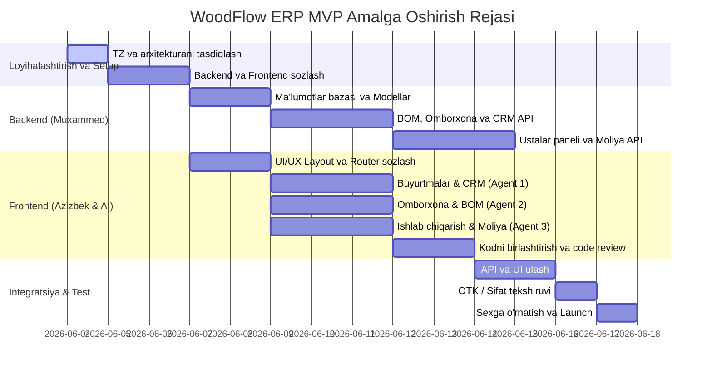

# 📅 WoodFlow ERP: Yo'l Xaritasi va Amalga Oshirish Rejasi (Roadmap)
> **Loyiha Boshqaruvi va Vaqt Rejasi (Gantt Chart)**

Mebel ishlab chiqarish korxonasi uchun tizimni 2 hafta (14 kun) ichida MVP (Minimal Ehtiyojlarni Qondiruvchi Versiya) ko'rinishida topshirish rejalashtirilgan.

---

## 1. Loyiha Bosqichlari va Gantt Grafikasi

---

## 2. Kunbay Amalga Oshiriladigan Ishlar (Daily Milestones)

### 🗓️ Bosqich 1: Rejalashtirish va Asos (Kun 1 - 3)
* **Kun 1 (Bugun - Ertaga 06:00 gacha):** 
  * TZ (PRD), API spetsifikatsiyasi va jamoa yo'riqnomalarini yakunlash va tasdiqlash.
* **Kun 2:**
  * **Backend:** PostgreSQL ma'lumotlar bazasini sozlash, Django modellarini (Users, Customers, Orders, Inventory) yaratish va migratsiyalarni amalga oshirish.
  * **Frontend:** Azizbek React loyihasini yaratadi. Tailwind CSS, Shadcn UI kutubxonalarini o'rnatadi. Loyihaning umumiy layout (sidebar, header, dark mode) va Router tizimini sozlaydi.
* **Kun 3:**
  * **Backend:** JWT avtorizatsiya tizimini joriy etish, foydalanuvchilar va rollarni boshqarish.
  * **Frontend:** Azizbek 3 ta AI agenti uchun tayyor GitHub repository branchlarini ochadi, ularni ofis kompyuterlaridagi agentlarga bog'laydi.

### 🗓️ Bosqich 2: Modullarni Ishlab Chiqish (Kun 4 - 8)
* **Kun 4 - 5:**
  * **Backend:** CRM (Orders/Customers) va Inventory (Omborxona) CRUD endpointlarini tugatish. BOM yaratish mantig'ini yozish.
  * **Frontend Agent 1:** Mijozlar bazasi, buyurtma yaratish va buyurtma tafsilotlari sahifalarini bitiradi.
  * **Frontend Agent 2:** Ombor tovarlari jadvali, kirim-chiqim operatsiyalari va BOM tahrirlovchisini yaratadi.
* **Kun 6 - 7:**
  * **Backend:** Ishlab chiqarish bosqichlari (Kanban statuslari) va Ustalar paneli uchun API'larni ishlab chiqish. Moliya tranzaktsiyalari hisobi.
  * **Frontend Agent 3:** Kanban doska, ustalar uchun planshet versiyasi va Moliya oynasini yakunlaydi.
* **Kun 8:**
  * **Frontend Lead (Azizbek):** 3 ta AI agentining branchlaridagi pull requestlarni ko'rib chiqadi. Konfliktlarni hal qilib, kodlarni `dev` branchiga birlashtiradi. UI dizayn tizimining to'g'riligini va xatolar yo'qligini tekshiradi.

### 🗓️ Bosqich 3: Integratsiya va Yakunlash (Kun 9 - 12)
* **Kun 9 - 10:**
  * **Backend & Frontend Integratsiyasi:** API endpointlarni frontend bilan to'liq bog'lash. Avans to'lovlari, material chegirish va usta oyliklarini real ma'lumotlar bilan tekshirish.
* **Kun 11 - 12:**
  * **Integratsion Testlar:** Tizimni "buyurtma berish -> chizma yuklash -> material chegirish -> kesish (raskroy) -> yig'ish -> tayyor mahsulot -> usta oyligi hisoblanishi" zanjiri bo'yicha to'liq test qilib chiqish. Topilgan xatolarni (bugs) tuzatish.

### 🗓️ Bosqich 4: Deploy va Launch (Kun 13 - 14)
* **Kun 13:** Tizimni serverga joylashtirish (backend: Docker/Uvicorn, frontend: Vercel yoki sex serveri). Sexdagi 3 ta ofis kompyuteriga tizimni brauzer orqali sozlash.
* **Kun 14:** Ustalar va ofis xodimlariga tizimdan foydalanish bo'yicha trening o'tkazish. Tizimni to'liq ishga tushirish (Go-Live).
